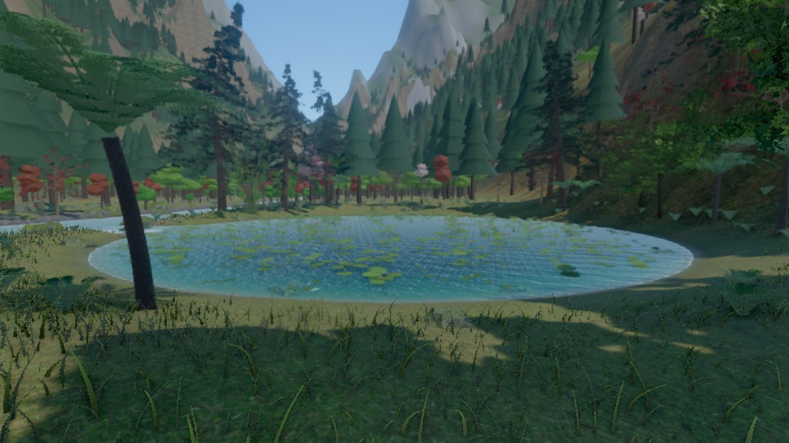
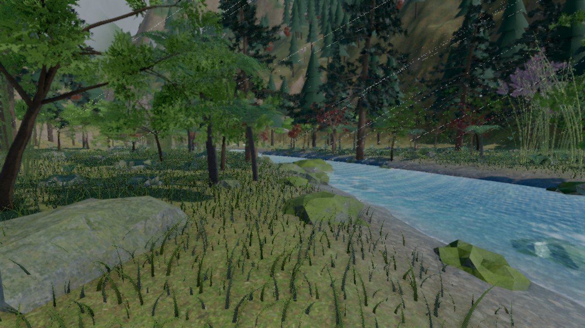
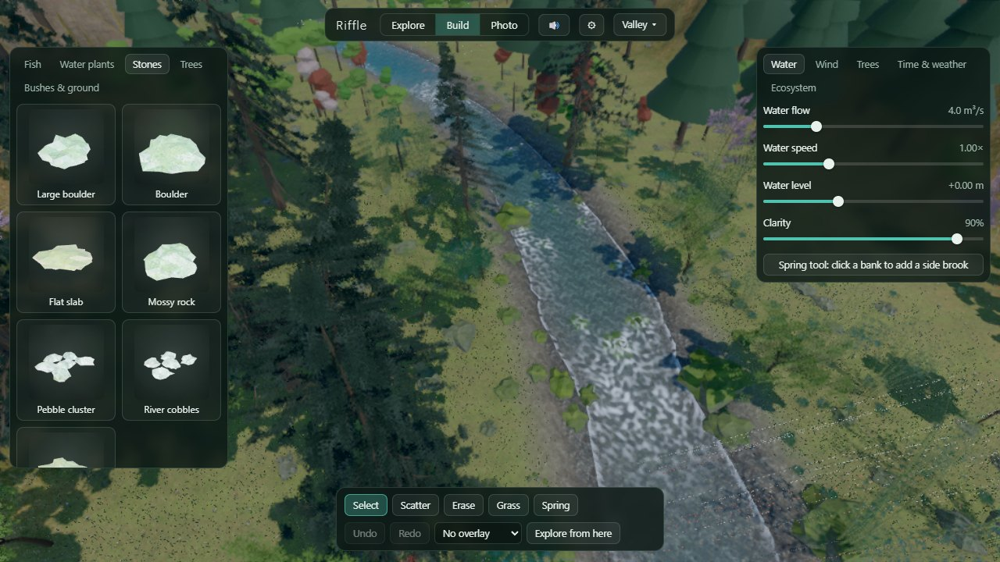
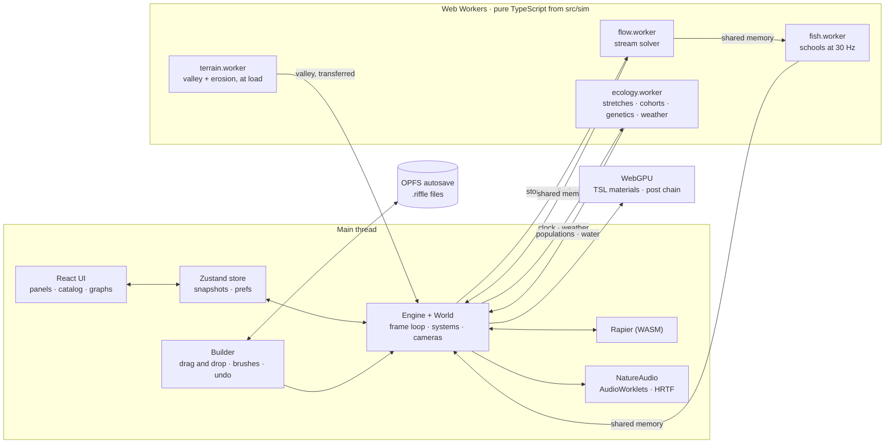

# Riffle

[](https://github.com/arunmariappan/Riffle/actions/workflows/ci.yml)
[](LICENSE)

A living monsoon mountain stream that runs entirely in the browser. You walk, wade and swim among schools of colorful
fish. In a builder view you drag in stones, plants, trees and fish, and set the water flow, the wind and how the trees
move. The ecosystem keeps running underneath: fish breed and slowly adapt to the stream you shape, plants spread where
water and light suit them, and the monsoon raises the river.

It's all TypeScript: three.js `WebGPURenderer` with TSL shaders, simulation cores in Web Workers that share memory with
the renderer, React 19 for the panels, and sound synthesized live in AudioWorklets. Nothing is a prebuilt asset except
a few CC0 ground textures. The terrain, trees, plants, rocks, fish and sounds are all generated from a seed.

*A riffle is the shallow, fast stretch of a stream where the water carries the most oxygen and fish gather to feed.*



| The riffles | The builder |
|---|---|
|  |  |

> **Status.** All ten phases of [the plan](docs/plan.md) are implemented, and CI is green.
>
> - **Phases 0–2** (valley, water, the first fish) were checked on a GPU.
> - **Phases 3–9** were written on a machine without a GPU. They pass the type check, lint, 155 unit tests and the
>   build.
> - **Not yet run:** the browser tests, the benchmarks and the visual checks for Phases 3–9. They are tracked as
>   [local GPU checks](docs/plan.md#local-gpu-checks-run-on-your-pc) (G1–G23), and the parts most likely to need
>   tuning are listed as open points P14–P27.

## Quick start

You need:

- **Chrome or Edge on a desktop, with WebGPU.** Riffle is developed on an AMD RX 5700 XT (8 GB), where the High preset
  ran at about 55 fps at 1080p in the Phase 2 benchmark.
- **Node.js 24** (22.12 or later works).
- **pnpm.** The version is pinned in `package.json`; `corepack enable` sets it up.
- **Git LFS**, for the CC0 source textures in `assets-src/`.

```sh
git lfs install
git clone https://github.com/arunmariappan/Riffle.git
cd Riffle
pnpm install
pnpm assets     # CC0 sources → public/assets/ (WebP, not committed)
pnpm dev        # http://localhost:5173 with hot reload, the stats overlay and a Tweakpane dev panel
```

`pnpm start` builds and serves the optimized app at http://localhost:4173 instead. The first load in a fresh browser
profile compiles every shader, which took 92 s on the dev PC (Windows, D3D12). Chrome caches the shaders after that.
`npx tsx tools/fresh-clone.ts` repeats the clone → install → checks → build steps in a temporary folder.

Controls, saving, photo mode and troubleshooting are covered in the **[player guide](docs/guide.md)**.

## Tech stack

| Area | What's used |
|---|---|
| Rendering | three.js 0.186 `WebGPURenderer`, TSL node materials, `RenderPipeline` post chain, AgX tone mapping |
| UI | React 19, Radix UI, Zustand 5, uPlot (ecosystem graphs) |
| Physics | Rapier 0.21 (WebAssembly): terrain heightfield, settling stones, the player |
| Concurrency | Web Workers via Comlink, SharedArrayBuffer double buffers |
| Trees | EZ-Tree geometry, drawn with Riffle's own wind materials |
| Audio | Web Audio: AudioWorklets plus HRTF `PannerNode`s. Every sound is synthesized |
| Video | WebCodecs + Mediabunny (MP4 time-lapses streamed to disk) |
| Content | JSON files validated with Zod 4 |
| Tooling | Vite 8, TypeScript 6.0, pnpm 12, ESLint 10, Prettier, tsx |
| Tests | Vitest 5 in Node; Playwright driving real Chrome and Edge on the GPU |

## Architecture



The design rules, and how each one is enforced:

1. **`src/sim/` is pure TypeScript.** It must not import three.js, React, the DOM, `src/engine`, `src/app` or
   `src/procgen`. ESLint enforces this with `no-restricted-imports` and `no-restricted-globals`. The same code then
   runs in the workers and in Vitest.
2. **Workers simulate; the main thread renders.** Commands go to the workers through Comlink. Large results (the flow
   field, fish states) come back through SharedArrayBuffers, each one double-buffered with a version number
   ([`doubleBuffer.ts`](src/sim/shared/doubleBuffer.ts)) so readers never see a half-written frame.
   SharedArrayBuffer needs cross-origin isolation, so `vite.config.ts` sends COOP/COEP headers. Because of those
   headers, **everything has to be bundled locally**: no CDN scripts, fonts or textures.
3. **React shows state; it doesn't run the world.** The engine writes snapshots into the Zustand store a few times a
   second, and UI actions call engine methods. Nothing in React re-renders every frame.
4. **Runs are reproducible.** Randomness comes from seeded generators ([`rng.ts`](src/sim/rng.ts)) and the simulation
   uses fixed steps, so the same seed and the same edits give the same valley and the same ecosystem. A save stores
   the seed plus your edits, not geometry.
5. **Content is data.** Species and objects are JSON files checked against Zod schemas at load (see
   [Adding content](#adding-content)).

### Threads and update rates

| Where | What | When |
|---|---|---|
| Main thread | Frame loop (capped at 60 fps), World systems, Rapier, builder, audio parameters | Every frame |
| `terrain.worker` | Valley generation: stream course, distance fields, ridges, hydraulic and thermal erosion, masks, grass density | Once at load (about 2 s) |
| `flow.worker` | Stream solver: a full solve at load, local re-solves after edits | When something changes |
| `fish.worker` | Schooling agents (up to 2,000) | 30 Hz; the main thread extrapolates between steps |
| `ecology.worker` | Water quality per stretch, fish cohorts, genetics, plant spread, weather and catchment | Fixed simulated hours and days, caught up to the clock |
| AudioWorklets | Wind, water and rain synthesis | Audio rate |
| GPU | Materials (wind sway, water, fish swimming) and the post chain | Every frame |

### Startup

1. [`main.tsx`](src/main.tsx) checks for WebGPU (and shows `Unsupported` if it's missing), then renders the start
   screen.
2. **Enter the valley** loads [`app/boot.ts`](src/app/boot.ts) with a dynamic import. The engine chunk (about 10 MB,
   mostly EZ-Tree textures and the Rapier WebAssembly) stays out of the first page, which is about 590 KB.
3. `Engine.create` sets up the renderer. It asks the adapter for more textures and samplers per shader stage, because
   the terrain shader needs more than WebGPU's default of 16.
4. [`World.create`](src/engine/world/World.ts) builds the valley:
   1. The terrain worker generates the valley.
   2. Rapier gets the terrain heightfield.
   3. The trees, bushes and stones are scattered by their content rules.
   4. The flow solver runs its first solve.
   5. Water plants are placed by the solved depth and current.
   6. The fish, the grass and the ecology start.
   7. Every material is compiled (`compileAsync`) behind the loading screen.
5. After that come the builder, the catalog thumbnails (rendered live and cached by content hash) and the audio, which
   starts on your first click. The loading screen waits for smooth frames, then autosave starts.

### One frame

`World.update` runs its systems in a fixed order. The order matters: for example, the fish read the flow and the
camera position after both have moved.

```
clock → wind and time uniforms → flow textures → active camera (explore / builder / follow / photo) → Rapier step
→ placed items → weather blend → ecology results → wetness, sky, atmosphere, underwater, exposure and lightning
→ season looks (once a second) → terrain, trees, plants, air particles, grass, debris → spray and splashes
→ fish → rain → kingfisher → ecology stretches (after flow edits) → overlays
```

## Code map

| Path | What's there |
|---|---|
| [`src/app/`](src/app) | React UI. `App.tsx` reads the URL parameters and switches modes, `boot.ts` starts the engine. Also `panels/`, `builder/` (catalog, toolbar), `shell/` (top bar, settings, fish card) |
| [`src/state/`](src/state) | Zustand store, valley settings (saved in files), per-browser preferences, quality presets |
| [`src/engine/`](src/engine) | The three.js side. `Engine.ts` (renderer, loop, stats, device loss) and [`world/World.ts`](src/engine/world/World.ts), which wires every system together. Systems live in `terrain/`, `sky/`, `water/`, `vegetation/`, `fauna/`, `ecology/` (the worker bridge and fish hand-off), `weather/`, `photo/`, `overlays/` and `builder/`. Also `post/pipeline.ts`, `bench.ts` and `thumbnails.ts` |
| [`src/sim/`](src/sim) | Pure simulation: `terrain/`, `flow/`, `boids/`, `ecology/`, `weather/`, `wind/`, `time/` (clock, sun and moon), `scatter/`, `particles/`, `fauna/`, `shared/`, `rng.ts`, `noise.ts` |
| [`src/workers/`](src/workers) | Four workers, each a thin Comlink wrapper around `src/sim` |
| [`src/procgen/`](src/procgen) | Seeded geometry: fish bodies, bamboo, tree ferns and other plants, rocks, the EZ-Tree wrapper |
| [`src/builder/`](src/builder) | Pure builder logic: placement rules, analytic picking, brushes, the edit layer, undo/redo |
| [`src/audio/`](src/audio) | Audio graph and listener (`AudioEngine`), sound emitters fed by the simulation (`NatureAudio`), the mix for where you stand (`scene.ts`), synthesis in `dsp/`, `worklets/` |
| [`src/photo/`](src/photo) | Pure photo maths: the lens and its sample pattern, filters, time-lapse planning, pixel packing |
| [`src/save/`](src/save) | The `.riffle` format, save data and migrations, autosave, OPFS and File System Access storage |
| [`src/perf/`](src/perf) | Dynamic resolution controller |
| [`src/content/`](src/content) + [`content/`](content) | Zod schemas and the catalog loader; the JSON for fish, plants, stones, trees and bushes |
| [`tools/`](tools) | Node scripts run with `tsx` (see [Dev tools](#dev-tools)) |
| [`tests/`](tests) | `unit/` (Vitest) and `e2e/` (Playwright) |
| [`docs/`](docs) | [Plan](docs/plan.md), per-phase checklists in [`phases/`](docs/phases), the [player guide](docs/guide.md), screenshots |

## How the main systems work

- **Water** ([`src/sim/flow/field.ts`](src/sim/flow/field.ts)):
  - The solver works on a grid that follows the river: cross-sections every 0.5 m, with 0.5 m cells across (about
    2,200 × 49 cells).
  - It solves a stream function with conveyance K = h^5/3 / n, Manning water levels with backwater, and red-black
    SOR.
  - After a stone is placed, only the nearby sections are re-solved.
  - `FlowSystem` turns the results into a flow texture in stream coordinates for the river shader, plus a world
    water-level map for caustics and wet lines.
- **Fish** ([`src/sim/boids/school.ts`](src/sim/boids/school.ts)):
  - Each fish steers by its swimming effort: the velocity it wants over the ground minus the local current. Holding
    station and facing upstream emerge from that, with no special case.
  - On top of that come schooling, shelter behind stones, food, fleeing, habitat preference and night rest.
  - Each fish is 16 floats in the shared buffer. The renderer draws one `InstancedMesh` per species, each with its
    own pattern shader.
- **Ecology** ([`src/sim/ecology/`](src/sim/ecology)):
  - The stream is split into stretches of about 50 m, each with its own temperature, oxygen, light, insects, algae,
    nutrients and turbidity.
  - Fish are tracked as cohorts with five heritable traits (breeder's equation, plus mutation). Fish near the camera
    are handed off to the fish worker as individuals.
  - Ground and water plants grow, spread and die back.
  - The weather feeds a catchment that raises and clouds the stream after rain.
  - A 10-year run takes about a second and is exactly reproducible.
- **Wind**: a few shader uniforms plus gust fronts computed in the shader
  ([`vegetation/wind.ts`](src/engine/vegetation/wind.ts)), mirrored by a CPU twin
  ([`sim/wind/windField.ts`](src/sim/wind/windField.ts)) for particles, audio and seed spread. **Change both
  together.**
- **Rendering**:
  - The post chain depends on the preset ([`post/pipeline.ts`](src/engine/post/pipeline.ts)): an MRT scene pass →
    GTAO on Medium, or SSGI on High and Ultra → TRAA → bloom → grading and the underwater look.
  - Each preset sets a render scale (0.7 on Low up to 1.0 on Ultra), and TRAA upscales to the screen. Dynamic
    resolution moves the scale within the preset's range to hold the frame rate.
  - The terrain is drawn as 128 m chunks with four detail levels.
  - Trees are full EZ-Tree models up close and low-poly "lite" trees beyond 55 m.
- **Audio** ([`src/audio/`](src/audio)):
  - Nothing is recorded. Water is built from bubble resonances and filtered noise, and wind is noise shaped by the
    same gusts as the visuals.
  - Rain, birds, cicadas, frogs, thunder and footsteps are synthesized fresh each time.
  - The stream's emitters slide along the river with you.
- **Photo mode** ([`engine/photo/`](src/engine/photo)):
  - A still averages 64–256 frames. Each one jitters the camera by a sub-pixel, moves it across the lens aperture and
    shifts the sun across its disk, which gives smooth edges, real depth of field and soft shadows.
  - Time-lapses step the simulation in fixed amounts, are encoded with WebCodecs and are muxed to MP4 by Mediabunny.
- **Saving** ([`src/save/`](src/save)):
  - A `.riffle` file is the `RIFFLE` magic bytes followed by a gzip stream. Inside: the format version, a JSON
    document (seed, clock, settings, edit layer, view) and named binary sections (ecology, plants).
  - Autosaves go to OPFS, keeping the last three.
  - **When the saved JSON changes shape, bump `SAVE_VERSION` and add a migration.**
    [`tests/unit/fixtures/save-v1.json`](tests/unit/fixtures/save-v1.json) guards loading of old saves.

## Adding content

Add a JSON file to `content/<category>/`. [`catalog.ts`](src/content/catalog.ts) finds it with `import.meta.glob`,
validates it against [`schema.ts`](src/content/schema.ts), and reports an invalid file as an error without stopping
the load. The new item appears in the builder's catalog with a thumbnail rendered on first load.

| Category | Generator kinds | What JSON alone can change |
|---|---|---|
| `trees/` | `ez-tree` (shape `round`, `cone` or `spreading`), `bamboo`, `tree-fern` | Size, shape, colors, season looks, wind stiffness, placement and tolerance rules |
| `stones/` | `rock` | Size, shape, texture, density, moss |
| `bushes/` | `fern`, `wildflowers`, `orchid` | Height, flower colors, season looks |
| `plants/` | `lotus`, `lily`, `java-fern`, `cryptocoryne`, `rotala`, `moss` | Height, flower and tip colors, where it grows (depth, current) |
| `fish/` | Body `torpedo`, `deep`, `long` or `flat`; fins `forked`, `flowing`, `rounded` or `sucker`; pattern `stripes`, `pearls`, `leopard`, `koi`, `gold` or `plain` | Colors, behavior, habitat, diet, spawning, life history, gene means and spread, school size |

[`content/fish/denison-barb.json`](content/fish/denison-barb.json) is a complete example. A new kind of shape needs
code in three places:
1. the enum in `schema.ts`;
2. a generator in `src/procgen/`;
3. a case in the system that draws that category (`TreeSystem`, `PlantSystem`, `FishSystem` or `RockSystem`).

Assets must be free (CC0 or similar) and credited in [CREDITS.md](CREDITS.md).

## Testing

| Suite | What it covers | How to run |
|---|---|---|
| Unit: 155 tests, Vitest in Node | Simulation, generators, builder logic, saves, audio scene and DSP, photo maths. Fixtures in `tests/unit/` build a small valley and a real one | `pnpm test`, `pnpm test:watch` |
| End to end: 39 tests, Playwright | Smoke, valley, water, wind, builder, fish, ecology, audio and photo, in real Chrome and Edge on the GPU. They run one at a time and start `pnpm dev` (or reuse a running one) | `pnpm test:e2e`, or `pnpm test:e2e tests/e2e/wind.spec.ts` for one spec |
| Benchmarks | The `valley`, `storm` and `fish` (500 fish) flights: fps, GPU and CPU time, draw calls. JSON goes to `bench-results/` | `pnpm bench` |
| Soak test | Tours every mode and samples memory each minute | `SOAK_MINUTES=60 pnpm test:e2e tests/e2e/soak.spec.ts --project=chrome` |

CI runners have no GPU, so [CI](.github/workflows/ci.yml) runs only what works without one: install, typecheck, lint,
Prettier check, unit tests and the build. Browser tests and benchmarks run locally.

**Test hooks.** Once loading finishes, `window.__riffle` holds `{ ready, engine, world, error }`. Tests and tools
drive the app through it, for example `__riffle.world.goToSpot('pond')` or `__riffle.engine.stats`. These URL
parameters help with debugging and testing:

| Parameter | Effect |
|---|---|
| `?autostart` | Skip the start screen |
| `?freeze` | Pause the clock and hide the UI, for repeatable screenshots |
| `?seed=…` | Grow a different valley |
| `?spot=waterfall\|rapids\|riffles\|pool\|bend\|pond&hour=…&day=…` | Start at a viewpoint, hour and day of the year |
| `?quality=low\|medium\|high\|ultra` | Quality preset |
| `?bench=valley\|storm\|fish` | Run a benchmark flight |
| `?allfish` | Show fish in every stretch, not only near the camera |
| `?scene=test` | The Phase 0 rendering test scene instead of the valley |
| `?stats` · `?dev` | Stats overlay · Tweakpane dev panel (both are on by default in `pnpm dev`) |
| `?continue` | Load the latest autosave |

## Dev tools

All of these run with `npx tsx tools/<name>.ts`. The browser tools (`golden`, `views`, `shot`, `probe`, `toggle`)
open Chrome against a running `pnpm dev`.

| Tool | Use |
|---|---|
| `golden.ts <outDir> [spots] [hours] [day]` | Screenshots at each viewpoint and hour, with fps and GPU time |
| `views.ts <outDir>` | Scripted camera views: underwater, waterfall, riffle close-up, fish |
| `shot.ts "<path?query>" <out.png>` | One screenshot of any URL, plus any console errors |
| `probe.ts "<path?query>" "<js expression>"` | Evaluates an expression in the running app and prints the result as JSON |
| `montage.ts`, `lum.ts`, `toggle.ts` | Tile PNGs into one image; mean brightness of screenshots (exposure tuning); brightness after toggling features in the app |
| `fresh-clone.ts` | Clone → install → checks → tests → build, in a temporary folder |
| `fetch-assets.ts`, `assets.ts` (`pnpm fetch-assets`, `pnpm assets`) | Download the CC0 sources listed in `asset-manifest.ts`; process them into `public/assets/` |

## Conventions and gotchas

- **Before you push**, run `pnpm typecheck && pnpm lint && pnpm format:check && pnpm test`, the same checks CI runs.
  Don't pipe a check into `tail` before `&&`, because the pipe hides its exit code.
- **Line endings are LF** (`.gitattributes`). Git on Windows with `autocrlf` would otherwise make Prettier's check
  fail.
- **TypeScript is pinned to `~6.0`.** TypeScript 7 breaks typescript-eslint.
- **`three` is aliased to `three/webgpu`** so that EZ-Tree and Riffle share one three.js. Import from
  `three/webgpu` and `three/tsl`. TSL's typings are loose, so `any` on TSL nodes is allowed in `src/engine`,
  `src/procgen` and `src/photo`.
- **Decide anything that affects a shader when the mesh is created.** Toggling `castShadow`, or anything else that
  changes a material's shader, at runtime forces a full recompile and a long stall.
- **D3D12 allows 16 samplers per shader stage.** The terrain shader is already at that limit. Count textures before
  adding one to an existing material (plan items C15 and P10).
- **Add new meshes to the scene in the `World` constructor.** Materials compile at load, and empty `InstancedMesh`es
  are briefly given `count = 1` so they compile too; anything added later compiles in the middle of a frame.
- **Rapier:** the heightfield is column-major, and `world.step()` must run once before raycasts hit anything.
- **`public/assets/` is generated and never committed.** CC0 sources live in `assets-src/` under Git LFS.

## Project docs

- [`docs/plan.md`](docs/plan.md): the design and its decisions (D-numbers), progress per phase, open points
  (P-numbers), local GPU checks (G-numbers) and changes from the original design (C-numbers). Check it before changing
  a system.
- [`docs/phases/`](docs/phases): what each phase built, as a checklist.
- [`CLAUDE.md`](CLAUDE.md): working rules for Claude Code sessions in this repo.

## License

[MIT](LICENSE). Asset credits are in [CREDITS.md](CREDITS.md).
