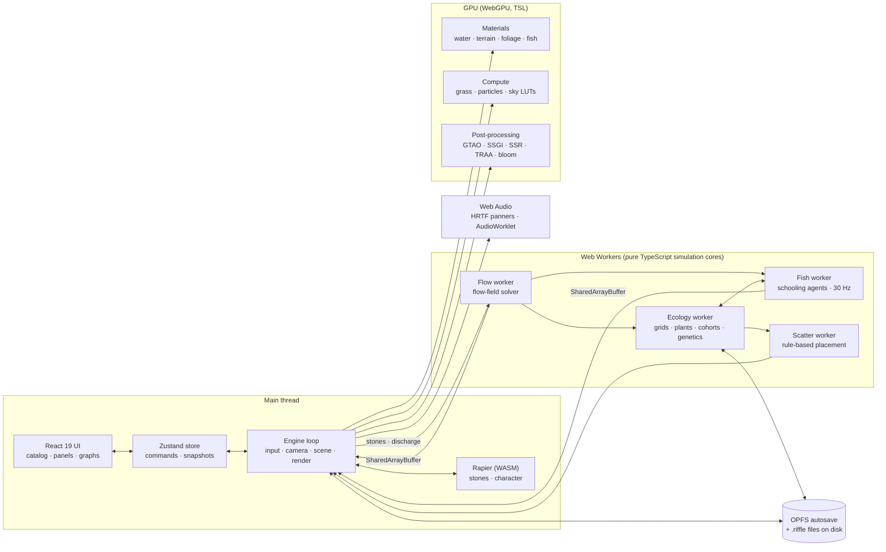

# Riffle: implementation plan (browser version)

Riffle is a nature world that runs **in the browser**: an invented monsoon mountain valley with a living stream. You
walk, wade and swim among colorful fish, then switch to a builder view to drag in fish, water plants, stones, trees
and bushes, and to control water flow, wind and how the trees move. The valley is a living ecosystem. Fish school,
feed, breed and slowly adapt to the stream you shape. Plants spread where water and light suit them. Seasons, monsoon
rains and day and night change the whole valley.

*A riffle is the shallow, sparkling, fast stretch of a stream where the water carries the most oxygen and fish gather
to feed.*

Written 2026-10-04. Rewritten the same day for **browser only** (replacing an earlier Unreal Engine plan) and updated
with your answers: 1080p at 60 Hz, an invented valley that is as vibrant and natural as possible, colorful and
elegant fish (the monsoon mountain stream theme), no access from other devices, free assets only, and the codename
Riffle. The plan lives in the repo at `docs/plan.md`. Status: **plan only, nothing built yet.** Decisions marked *(your choice)* came from your answers. The rest
are recommendations you can change here.

**Contents:**
[1. Tech stack](#1-tech-stack) ·
[2. Decisions](#2-decisions) ·
[3. Your PC and the browser](#3-your-pc-and-the-browser) ·
[4. The experience](#4-the-experience) ·
[5. Architecture](#5-architecture) ·
[6. Systems design](#6-systems-design) ·
[7. Content catalog](#7-content-catalog-and-adding-new-things) ·
[8. Making it look real and vibrant](#8-making-it-look-real-and-vibrant) ·
[9. Performance and memory budgets](#9-performance-and-memory-budgets) ·
[10. Phases](#10-phases) ·
[11. Testing](#11-testing) ·
[12. Risks](#12-risks) ·
[13. Questions answered](#13-questions-answered) ·
[14. References](#14-references) ·
[Appendix: what replaced what from the Unreal plan](#appendix-what-replaced-what-from-the-unreal-plan)

---

## 1. Tech stack

**Everything is TypeScript**, including the shaders: TSL is written in TypeScript and compiles to WGSL. Content data
(species, objects) is JSON.

| Layer | Choice | Why |
|---|---|---|
| Language | **TypeScript (strict)** | One language for the app, shaders, workers, audio processors, generators, tools and tests. |
| 3D engine | **Three.js `WebGPURenderer` + TSL** *(your choice)* | The largest web 3D community. Shaders are written in TypeScript. It has compute shaders, a node-based post-processing stack (GTAO, SSGI, SSR, TRAA, bloom, depth of field) and cascaded shadows (`CSMShadowNode`). **Pin the exact version**, because the TSL APIs still change between releases. |
| Graphics API | **WebGPU only** (no WebGL fallback) | Fish, grass, particles and terrain erosion need compute shaders. Browsers without WebGPU get a friendly "please use Chrome or Edge" page. |
| Browsers | **Desktop Chrome and Edge** *(your choice)* | On Windows both run WebGPU through Direct3D 12. One quality path to tune. |
| Output | **1080p at 60 Hz** *(your choice)* | Your monitor. Dynamic resolution keeps 60 fps where it can. |
| UI | **React 19** *(your choice)* + Zustand + Radix UI primitives + CSS Modules | React draws only the panels around and over the 3D view. The 3D engine runs outside React, so React never slows the render loop. Zustand is the shared store between the UI and the engine. Radix supplies accessible sliders, tabs, dialogs and tooltips. |
| Charts | **uPlot** | Fast time-series graphs for the ecosystem panel (populations, water quality). |
| Physics | **Rapier** (`@dimforge/rapier3d-compat`, WebAssembly) | Stones fall and settle; the player character collides with the world. Called from TypeScript. |
| Simulation | **Web Workers** + **Comlink** + **SharedArrayBuffer** | The flow solver, fish, ecology and placement run off the main thread. Big arrays are shared without copying. |
| Generated content | **EZ-Tree** (`@dgreenheck/ez-tree`, MIT) + **our own generators** | EZ-Tree for broadleaf and pine trees. Our own generators for the terrain (with erosion), bamboo, tree ferns, water plants and **all fish**. This keeps everything free and lets genes drive how fish look. |
| Raycasting | **three-mesh-bvh** | Fast picking and selection in the builder. |
| Audio | **Web Audio API** (HRTF panners, AudioWorklet) via three.js `AudioListener` / `PositionalAudio` | Built into the browser, with 3D (spatial) sound. |
| Video export | **WebCodecs + Mediabunny** (MPL-2.0) | Time-lapses are encoded to MP4 in the browser, using your GPU's hardware encoder, and written straight to disk. |
| Saving | **OPFS** (the browser's private file system) + **File System Access API** | Autosave inside the browser, plus "Save valley as…" / "Open valley…" `.riffle` files on your disk. |
| Assets | **Free only** *(your choice)*: Poly Haven and ambientCG (CC0), freesound.org (CC0 preferred), generated content. **glTF (.glb) + KTX2**, prepared with **glTF-Transform** | Compressed meshes (meshopt) and GPU-compressed textures load fast and use less video memory. Everything is free to redistribute, so it all lives in the repo (Git LFS). |
| Build | **Node.js 24 LTS, pnpm, Vite** | Vite's dev server reloads instantly on save and sends the headers SharedArrayBuffer needs. |
| Quality | **ESLint (typescript-eslint) + Prettier** | A lint rule stops `src/sim/` from importing three.js, so the simulation cores stay pure and testable. |
| Tests | **Vitest** (unit) + **Playwright** (end-to-end, screenshots, benchmark) | Playwright drives real Chrome and Edge on your GPU. |
| Dev tools | Tweakpane (debug panel, dev builds only), stats-gl, Chrome DevTools, WebGPU timestamp queries | Tuning and profiling. |
| Hosting | **Local only, this PC only** *(your choice)* | `pnpm dev` while building, `pnpm start` for the optimized build, opened at `http://localhost`. |
| Source control | Git + Git LFS, public GitHub repo [`arunmariappan/Riffle`](https://github.com/arunmariappan/Riffle), GitHub Actions | CI checks types, lint and unit tests, and builds. End-to-end tests run locally because CI machines have no GPU. |

---

## 2. Decisions

| # | Decision | Choice | Notes |
|---|---|---|---|
| D1 | Platform | **Browser only: desktop Chrome and Edge, WebGPU required** *(your choice)* | No installer. Optionally installable as an app from Chrome or Edge so it opens in its own window (Phase 9). |
| D2 | Language | **TypeScript only** | Follows your one-language-per-project rule. Shaders are TSL, so no hand-written WGSL. Content data is JSON, which is data rather than code. |
| D3 | 3D engine | **Three.js `WebGPURenderer` + TSL** *(your choice)* | The exact version is pinned in `package.json` and upgraded on purpose at the start of a phase, after reading the release notes. |
| D4 | UI | **React 19** *(your choice)* + Zustand + Radix UI | The engine is plain TypeScript classes, not React components (no react-three-fiber), for full control of the render loop. |
| D5 | Hosting | **Local only, this PC only** *(your choice)* | Served at `localhost`, which browsers treat as secure (WebGPU requires a secure page). No HTTPS setup is needed. |
| D6 | "Evolve with nature" | **Living ecosystem** *(your choice)* | Fish school, feed, grow, breed and adapt (light genetics). Plants grow and spread by light, moisture, depth and flow. Seasons, monsoon rains and day and night change the valley. |
| D7 | Way to experience it | **Explore (walk, wade, swim) + Builder + Photo** *(your choice)* | Keyboard and mouse, with pointer lock for the first-person view. Gamepad support later. |
| D8 | World size | **A valley of about 1 km × 1 km with mountains on the horizon** | The densest detail is along the stream (a corridor about 100 m wide). Slopes have lighter vegetation and far trees become flat stand-ins (impostors). |
| D9 | Output | **1080p at 60 Hz** *(your choice)* | Dynamic resolution between about 70% and 100%, with TRAA upscaling. |
| D10 | Valley | **Invented, as vibrant and natural as possible** *(your choice)* | Built by our own terrain generator with water erosion. The art direction is set out in [8](#8-making-it-look-real-and-vibrant): vivid color that comes from the content and the light, not from over-processing. |
| D11 | Theme | **Monsoon mountain stream** *(your choice)* | An invented pan-Asian valley: golden mahseer, Denison barbs, white cloud minnows, celestial pearl danios, hillstream loaches, koi in the pond; rhododendron, Japanese maple, bamboo, wild cherry, tree ferns, orchids, lotus ([7](#7-content-catalog-and-adding-new-things)). |
| D12 | Fish look | **Colorful and elegant** *(your request)*: our own fish generator + pattern shaders | Body templates, long translucent fins with their own soft flutter, and patterns (stripes, pearls, leopard spots, koi patches, gold metallic scales, iridescence) driven by species and genes ([6.5](#65-fish)). |
| D13 | Lighting | **Dynamic sun + physically based sky + image-based lighting from the sky + cascaded shadows + GTAO + SSGI + SSR + TRAA, AgX tone mapping** | The browser has no Lumen-style global illumination, so this combination comes closest. Photo mode adds frame accumulation for clean, near-photographic stills ([6.10](#610-photo-mode-and-time-lapse)). |
| D14 | Water | **Our own flow-field solver in a worker + our own river mesh and water material** | Owning the water makes the water level easy: the surface really rises and falls with the flow ([6.2](#62-water-and-flow)). |
| D15 | Wind | **Our own wind system → shader uniforms + a wind texture** | Trees, bamboo, grass, water ripples, particles, audio and seed spread all read one wind state. |
| D16 | Vegetation | **EZ-Tree + our own bamboo, tree fern and water-plant generators + compute-generated grass + our own rule-based scatter system** | Far trees become impostors baked by our own tool. |
| D17 | Physics | **Rapier** | Stones settle with physics, then freeze into flow obstacles. Kinematic character controller for walking. |
| D18 | Fish simulation | **CPU agents in a worker + instanced meshes animated in the shader** | Fish agents are reproducible and testable, and the ecology needs them. Big minnow and danio schools can optionally run fully on the GPU. |
| D19 | Ecosystem simulation | **Two levels: the whole valley as coarse grids and population groups; individual fish only near the camera** | Runs in a worker. Results are reproducible: the same seed gives the same valley. |
| D20 | Evolution | **Simple genetics: 5 traits per fish species, plus a growth/spread trait for plants** | The breeder's equation at the population level. Color is pulled two ways, as in real fish: predators favor camouflage, mates favor brightness. A **predator pressure** slider lets you keep the fish vivid ([6.6](#66-ecosystem-and-evolution)). |
| D21 | Saving | **Autosave to OPFS + `.riffle` files on disk** | Browser storage can be cleared, so save files on disk are the real backup. Requests persistent storage. |
| D22 | Audio | **Web Audio, 3D sound** *(your choice)* | Water sound follows the flow; the wind is generated live, so it never loops audibly ([6.9](#69-spatial-nature-audio)). |
| D23 | Photo mode and time-lapse | **Accumulated, supersampled stills + MP4 time-lapse** *(your choice)* | Encoded in the browser with WebCodecs and Mediabunny, streamed to a file on disk. |
| D24 | Customization | **Drag-and-drop catalog + live sliders for water speed, wind and tree movement** *(your choice)* | Every item is a JSON file (plus a model only if it isn't generated), so adding things needs no code ([7](#7-content-catalog-and-adding-new-things)). |
| D25 | Assets | **Free only** *(your choice)* | CC0 textures and sounds plus generated content. CC-BY items, if any, are listed in `CREDITS.md`. |
| D26 | AI / LLM | **None** | Not selected; all of the video memory goes to the renderer. |
| D27 | Name and location | **Riffle** *(your choice)*, in **`D:\ai_workspace\Riffle`** | A public repo at [github.com/arunmariappan/Riffle](https://github.com/arunmariappan/Riffle), cloned 2026-10-04. The repo-local noreply identity is set. Public is fine because every asset is free (CC0, or CC-BY listed in `CREDITS.md`). |

### Goals

- A valley that looks as close to real as a browser allows on your PC, and as **vibrant** as nature gets: convincing
  in motion, near-photographic in photo mode.
- **Colorful, elegant fish**: gold mahseer, red-striped barbs, pearl-spotted danios and koi that move gracefully.
- You can feel it: stand in the stream and feel the flow push you, dive with the fish, hear the water change as you
  walk from the rapids to the pool.
- You can customize everything listed: fish, water plants, stones, trees, bushes, water flow, wind and tree movement,
  with drag and drop and live sliders.
- It evolves: leave it running and watch the valley change over days, seasons and fish generations.
- New species and objects can be added as content, without code changes.
- It opens in a browser tab with no install.

### Non-goals (v1)

- Firefox, Safari, phones, tablets, and WebGL fallback.
- Public hosting, or opening it from other devices.
- Paid assets.
- VR and multiplayer.
- Sculpting terrain or moving the river's course at runtime. Stones and logs change the flow locally.
- A full 3D fluid simulation. The 2D flow field gives the look and behavior.
- Sharing scenes, presets, the AI director, and a game loop with goals (none selected).

---

## 3. Your PC and the browser

Checked 2026-10-04: AMD Radeon RX 5700 XT 8 GB, Ryzen 7 3700X, 16 GB RAM, D: 314 GB free, a 1080p 60 Hz monitor.

| Topic | What it means for the browser version |
|---|---|
| GPU | Chrome and Edge run WebGPU on it through Direct3D 12. WebGPU has no ray-tracing features, so the card's missing hardware ray tracing doesn't matter. Desktop apps were measured holding about 4 GB of its video memory, and the browser itself uses some too, so **close other tabs and browsers** while running and budget about 3 GB for Riffle. |
| CPU | The browser's main thread is the usual bottleneck (preparing draw calls). The plan keeps it light: instancing, culling by area, and all simulation in workers. 8 cores leave plenty for the workers. |
| RAM | **16 GB is fine** for VS Code, Chrome and Vite. |
| Disk | A few GB in total (the project, node modules, assets). |
| Stability | **3 unexpected shutdowns on 2026-10-04 during long GPU runs.** A live 3D world in the browser loads the GPU just as heavily, so **Phase 0 starts with a stability check**. The app also caps itself at 60 fps, which matches your monitor. |

### Quality targets on this card

| Mode | Settings | Target |
|---|---|---|
| Explore / Builder (live) | High preset, 1080p with dynamic resolution (renders at about 70–100% and TRAA upscales) | 60 fps; 45 fps is the floor in the heaviest views (storms, the dense bamboo grove) |
| Photo mode (paused) | Ultra settings + **accumulation of 64–256 jittered frames** (supersampling, soft shadows, clean AO/GI, real camera bokeh), output up to 4K | Takes a few seconds per image, and these are the most realistic images |
| Time-lapse | Each frame lightly accumulated (about 8 samples) while the simulation speeds up | Written to MP4 at 1080p |

Be clear about the ceiling: in live play a browser renderer won't match a high-end desktop engine. Expect the look of
a polished indie game. Photo mode closes much of the gap for stills.

---

## 4. The experience

| Mode | Camera | What you do |
|---|---|---|
| **Explore** | First person (pointer lock) | Walk the valley. Wade into the stream (the current pushes you, deeper water slows you, splashes and ripples follow you). Swim and dive with no breath limit: turquoise pools, light shafts, caustics on the stream bed, schools of red-striped barbs flashing past. Stand still and curious fish come closer. Throw food and the koi gather. |
| **Builder** | Top-down / orbit (pan, zoom, rotate) | Drag fish, plants, stones, trees and bushes from the catalog into the world. Paint with brushes. Move, rotate, delete, undo. Sliders for water, wind, tree movement, time, weather and the ecosystem. Overlays show flow arrows, oxygen, light and fish density. |
| **Photo** | Free camera | Focal length, aperture and depth of field, click to focus, exposure, filters, accumulated high-res stills. Set up time-lapses. |

What makes it *feel* like nature:

- Nothing is perfectly still: grass, bamboo, leaves, water plants, light on the water and clouds all move a little,
  all the time.
- Vivid moments: blossom petals drifting down the stream in spring, monsoon mist rolling over the ridges, red maples
  reflected in a turquoise pool, a kingfisher's flash of blue over the water.
- Sound carries a lot of the immersion: the stream is loud at the rapids and almost silent at the pool, whistling
  thrushes at dawn, frogs on monsoon nights, and sound turns muffled underwater.
- The minimal UI hides itself in Explore mode. Comfort settings: FOV slider, head bob off by default, motion blur
  toggle.
- Time flows at the speed you choose, from real time up to a season every few minutes.
- An "Enter the valley" start screen. Its click also unlocks audio, because browsers block sound until you interact.

---

## 5. Architecture



### Principles

1. **The simulation cores are pure TypeScript** in `src/sim/`: flow solver, wind field, ecology, genetics, boids,
   time and weather. They import nothing from three.js or the DOM (enforced by a lint rule). That makes them
   unit-testable in Node, reproducible (seeded random numbers) and runnable in workers.
2. **Workers own the simulation, the main thread renders.** Commands go to the workers through Comlink. Big results
   (flow field, fish states, density grids) come back through SharedArrayBuffers, with no copying.
3. **React shows state, it doesn't run the world.** The engine publishes snapshots to Zustand at about 10 Hz for the
   HUD and graphs. The UI sends commands ("place stone", "set wind speed"). React never re-renders every frame.
4. **Data-driven content.** Species and objects are JSON files checked against Zod schemas when they load, so adding
   content needs no code ([7](#7-content-catalog-and-adding-new-things)).
5. **Generated, not downloaded:** terrain, bamboo, tree ferns, water plants and fish come from seeded generators in
   `src/procgen/`. The same seed always gives the same shape, so variation is free and genes can change how things
   look.
6. **Cross-origin isolation:** the Vite dev and preview servers send the `Cross-Origin-Opener-Policy: same-origin` and
   `Cross-Origin-Embedder-Policy: require-corp` headers, which SharedArrayBuffer requires. This is easy because the
   app is local only.

### Update rates

| System | Runs | Where |
|---|---|---|
| Render + input + wind uniforms | Every frame (capped at 60 fps) | Main thread + GPU |
| Flow solve | When something changes (stone placed, discharge changed, rain), about 20–80 ms per solve | Flow worker; the texture uploads when the solve finishes |
| Water surface detail | Every frame, in the material (flow-map scrolling + noise) | GPU |
| Fish agents | 30 Hz, positions blended between steps for drawing | Fish worker |
| Ecology step | Every simulated hour | Ecology worker |
| Re-scattering plants | When the plant density in an area changes noticeably | Scatter worker |
| Grass blades, particles | Every frame / when the camera moves | GPU compute |
| Sky lookup tables + lighting from the sky | When the sun moves more than about 0.5° | GPU compute |
| Autosave | Every 5 real minutes and when the tab is hidden or closed | Main thread → OPFS |

### Code layout

```
Riffle/
  package.json  pnpm-lock.yaml  tsconfig.json  vite.config.ts  eslint.config.js  playwright.config.ts
  index.html  CREDITS.md
  src/
    main.tsx               App entry: WebGPU check → start screen → engine + UI
    app/                   React UI: layout, catalog, panels, overlays, HUD, graphs
    state/                 Zustand stores (UI <-> engine), command types
    engine/                Plain TS: renderer setup, loop, quality presets, cameras, input
      sky/ terrain/ water/ vegetation/ fauna/ particles/ post/ physics/
    procgen/               Seeded generators: fish, bamboo, tree ferns, water plants, EZ-Tree wrapper
    sim/                   PURE TypeScript cores (no three.js / DOM imports)
      flow/ wind/ ecology/ genetics/ boids/ time/ weather/ scatter/ terrain/ rng.ts
    workers/               flow.worker.ts, fish.worker.ts, ecology.worker.ts, scatter.worker.ts
    builder/               Drag sessions, placement rules, brushes, gizmo, undo/redo
    audio/                 Web Audio graph, emitters, AudioWorklet processors
    photo/                 Photo mode, accumulation, capture, time-lapse encoder
    save/                  OPFS autosave, .riffle files, versioned format
    content/               Zod schemas, catalog loader
  content/                 Species and object JSON (fish/, plants/, stones/, trees/, bushes/)
  public/assets/           CC0 textures, rocks, sounds; baked terrain and trees (.glb / .ktx2, Git LFS)
  tools/                   TS scripts: terrain generation + erosion, asset pipeline, tree/impostor baking, thumbnails
  tests/
    unit/                  Vitest (mostly src/sim and src/procgen)
    e2e/                   Playwright (flows, screenshots, benchmark)
  docs/                    plan.md (this plan)
```

---

## 6. Systems design

### 6.1 Valley and mountains

- **Invented valley, generated** (`tools/terrain/` using `src/sim/terrain/`): layered noise is shaped by a hand-drawn
  valley mask and the stream's course, then **hydraulic and thermal erosion** run on the GPU. Slopes, gullies, scree
  fans and the stream channel look carved by water over a long time. The generator outputs a 4096² height map
  (about 0.25 m per sample) plus masks (flow accumulation, sediment, wetness) that the terrain material and the
  scatter rules use. The same seed always gives the same valley, so it can be tuned until it looks just right.
- **Shape:** steep, layered forested ridges fading into blue haze (Himalayan foothills and Western Ghats), mossy
  granite boulders along the stream, and snow on the highest distant peaks in winter.
- **Drawing it:** **level-of-detail patches** (64 × 64 vertex tiles chosen by a quadtree, CDLOD) read the heights in
  the vertex shader (TSL) and blend smoothly between detail levels. A CPU copy of the heights serves physics (a Rapier
  heightfield) and fast placement raycasts.
- **Distant mountains:** a low-detail ring out to 10–20 km, softened by the atmosphere's aerial perspective.
- **Terrain material:** layers chosen automatically by slope, height, wetness and the erosion masks (red-brown soil,
  leaf litter, moss, river sand, gravel, granite, snow), with **triplanar mapping on cliffs** (no stretched textures),
  large-scale variation to hide tiling, and a wet band near the water. A small paint layer allows touch-ups by hand.
- **The stream's course:** headwaters waterfall → rapids (loaches cling to the rocks) → riffles (barbs feed here) →
  deep turquoise pool (mahseer) → slow bend with gravel bars → backwater lotus pond (koi) → outflow. Each stretch is a
  different habitat.

### 6.2 Water and flow

**Flow-field solver (the core of "control water flow"), in `src/sim/flow/`:**

- A world-aligned grid at 0.5 m per cell (2048 × 2048). Only **wet cells** are simulated, kept in a sparse list (about
  100k cells).
- **Method:** a steady 2D depth-averaged potential-flow solve on a *stream function* ψ, weighted by local depth
  (∇·(1/h ∇ψ) = 0, one bank at ψ = 0 and the other at ψ = Q, where Q is the discharge). **Stones are bumps in the
  stream bed**, so the flow goes around them and speeds up over shallows naturally. The solve uses successive
  over-relaxation (SOR), starting from the last result, so a re-solve after one edit takes milliseconds to tens of
  milliseconds in the worker.
- **Depth and level:** each cross-section's water depth comes from Manning's relation (depth ∝ Q^0.6), so raising the
  discharge really raises the water.
- **Wakes and eddies:** added behind obstacles in proportion to obstacle size × local speed: slower water, more
  turbulence, a swirl added in the material. Fish shelter there.
- **Output:** a shared `Float32Array` (velocity, foam/turbulence, depth, surface height). The main thread uploads it
  as a half-float `DataTexture` (32 MB) when a solve finishes. `sampleFlow(x, z)` reads the shared array directly.

**Rendering the water (our own, in `src/engine/water/`):**

- **River mesh** generated from the stream's center line and width. Its vertices sit at the **surface height from the
  solver**, so the water level really changes with the discharge, and a wet line on the banks follows it. The pond is
  a flat mesh at its own level. The waterfall is a mesh with a falling-flow material plus spray and mist particles.
- **Water material (TSL):** two scrolling normal maps driven by the flow texture (the flow-map technique), plus small
  wind ripples. **Color from depth**, read from the depth buffer: clear in the shallows, **turquoise in the pools**,
  green-brown and cloudy after monsoon rain. **Refraction** of what's under the surface. Reflections from SSR + the
  sky, with Fresnel. **Foam** from the solver's foam channel (riffles, wakes, waterfall plunge). Soft shorelines.
- **Caustics:** an animated caustic pattern projected onto the bed and rocks below the water level, in their
  materials.
- **Underwater (camera below the surface):** absorption and fog by depth and turbidity, slight distortion, light
  shafts, floating particles, bubbles, a muffled audio filter.
- **Floating debris:** GPU particles (blossom petals, leaves, foam bits) drift with the flow texture.

**Controls (Builder → Water panel):**

| Control | Effect |
|---|---|
| **Water speed** (discharge in m³/s, plus a speed multiplier) | Re-solves the flow. Velocity, foam, water level, sound and the push on you all change. |
| Water level offset | Fine-tunes the level on top of what the discharge gives. |
| Clarity | Turbidity, which also rises after monsoon rain and in warm, still water with algae. Affects underwater visibility and the light reaching plants. |
| Spring tool | Adds a small inflow (a side brook) at a point on the bank. |

### 6.3 Wind and tree dynamics

- **Wind state:** direction, speed (0–25 m/s, shown as Beaufort force), gustiness and turbulence. **Gust fronts**
  travel across the valley, so you can see a gust sweep through the grass, then the bamboo, then the trees. It's
  computed as a scrolling noise texture plus moving fronts, fed to every shader as uniforms.
- **What reads it:** tree, bamboo, bush and grass shaders, water ripples (strongest on the pond), particles (falling
  petals and leaves, pollen, rain angle, mist drift), cloud speed, audio, and the ecology (seed spread direction and
  distance).
- **How trees move:** each part bends on its own: the trunk sways slowly, branches move with a short delay, and leaves
  flutter quickly. Bamboo culms are tall and flexible, so they sway in wide, slow arcs and lean into gusts. Each
  generator (EZ-Tree, bamboo, tree fern) writes each vertex's **branch level, pivot point and stiffness** into extra
  attributes, which the TSL wind shader uses.
- **Tree dynamics controls (Builder → Trees panel):** **flexibility**, **sway strength**, **leaf flutter** and
  **response delay** (how heavy the branches feel), as global sliders plus an optional override per species.
- **Wind controls (Builder → Wind panel):** a **direction** dial, a **speed** slider with a Beaufort label,
  **gustiness** and **turbulence**. A monsoon-storm preset drives all of them.
- Stretch goal: in strong storms, branches break off, fall into the stream and become new shelter for fish.

### 6.4 Vegetation and stones

- **Trees:** EZ-Tree presets for **tree rhododendron** (red and pink blooms), **Japanese maple** (red in autumn),
  **wild cherry** (blossom) and **Himalayan pine** (high slopes). Each species gets several seeded variations, baked by
  `tools/` into .glb files with 3 detail levels plus an **octahedral impostor** (a flat stand-in for far trees).
- **Our own generators (`src/procgen/`):** **bamboo** (jointed culms, nodes, leaf sprays, growing as clumps that
  spread), **tree ferns** (a fibrous trunk with a crown of arching fronds) and **water plants**.
- **Ground cover:** ferns, a moss carpet, **wild orchids** growing on trunks and rocks, grasses and wildflowers. Grass
  blades are generated by a compute shader in tiles around the camera (density from the ecology grid), bent by the
  wind and pushed aside by the player.
- **Water plants:** **lotus** (big leaves held above the water, pink flowers, seed pods) and **water lilies** in the
  pond; **Cryptocoryne** rosettes and **red Rotala** (bright red tips in clear, sunny, slow water) along the margins;
  **Java fern** that grows *on* stones and wood; **aquatic moss** on rocks in fast water. Underwater plants bend and
  sway with the **flow texture**, floating leaves drift and bob on ripples, and lotus stems sway with both wind and
  flow.
- **Stones:** scanned rocks from Poly Haven (CC0) as instanced meshes. Each stone has a mass and a **moss/algae
  amount** per instance that grows over time in damp shade and slow water (driven by the ecology). Java fern and moss
  can be dropped *onto* a stone.
- **Scatter system (our own, in `src/sim/scatter/`):** rule-based placement per 32 m tile using Poisson-disk sampling
  (natural spacing), with rules on slope, altitude, moisture, distance to water, depth, flow and the erosion masks.
  Rhododendrons and tree ferns go on the damp shaded slopes, bamboo on the lower banks, maples and cherries at the
  forest edge, pines on the high ridges, Cryptocoryne in the slow shallows, moss on the boulders. The same seed always
  gives the same layout. **Your edits are a separate layer** (additions and exclusion areas) applied on top, so
  regenerating never loses them.
- **Drawing it fast:** one instanced draw per (type × detail level) per group of tiles, culling by area, shadows only
  from near detail levels. If the main thread is still the bottleneck, add GPU culling with indirect draws.
- **Seasons:** a season uniform plus a random offset per instance drives the looks in [6.7](#67-time-sky-and-weather).

### 6.5 Fish

**Species and where they live:**

| Fish | Look | Habitat and behavior |
|---|---|---|
| **Golden mahseer** | Large, deep-bodied, gold metallic scales, reddish fins | Patrols the deep pools; shelters behind big boulders; **migrates upstream to spawn when the monsoon raises the water** |
| **Denison barb** | Slim torpedo, a red line above a black stripe, yellow-black tail | Fast, tight schools in riffles and runs; holds against the current |
| **White cloud minnow** | Small, iridescent bronze-green body, red-gold fins | Shimmering schools in calm, cool margins |
| **Celestial pearl danio** | Tiny, blue-grey body with pearl spots, orange-striped fins | Shallow, plant-filled margins and the pond edge |
| **Hillstream loach** | Flat, leopard-patterned, fins like suction cups | **Clings to rocks in the rapids** and grazes algae; the fastest water is its home |
| **Koi** | Long, graceful, red/white/black/gold patterns | Glides slowly in the backwater pond; comes to you for food (the one ornamental species) |

**Colorful and elegant (the fish generator, `src/procgen/fish/`):**

- **Body templates:** torpedo (barb, minnow, danio), deep-bodied (mahseer), long with barbels (koi), flat (loach).
  Proportions come from species ranges plus the fish's genes, so no two fish are identical.
- **Fins:** long, translucent membranes with fine rays. They flutter softly on their own and trail behind turns, which
  is most of what makes koi and mahseer look elegant.
- **Pattern shader (TSL):** stripes, pearl spots, leopard spots, koi patches (inherited between generations), a
  gradient from belly to back, **metallic gold scales** with a scale-pattern shimmer, and **iridescence** (thin-film
  color shifts) that catches the light as fish turn. Every value comes from the species palette and the fish's genes.
- **Graceful motion:** the swim shader bends the body as a smooth wave with speed-dependent tail beats, the head
  steadier than the tail; turns are banked and eased; koi glide between strokes.
- **Real sizes:** a mahseer is 60–120 cm and a pearl danio about 2.5 cm. The small fish are best enjoyed up close in
  the shallows or underwater. A "fish visibility" size option exists but defaults to real size.

**Behavior (fish worker):** schooling (separation, alignment, cohesion) plus:

- **Holding against the current:** barbs and loaches face upstream and hold their position in moving water.
- **Sheltering:** in the wake zones behind stones and logs (mahseer, barbs).
- **Depth and temperature preferences;** they avoid water too shallow to swim in.
- **Feeding:** rising to drifting insects (more at dawn and dusk), loaches grazing algae on rocks, and gathering at
  food you throw.
- **Fleeing:** scattering from fast movement, splashes or a diving kingfisher. A **shyness** trait sets how soon they
  return; curious fish come closer when you stand still.
- **Night:** resting near the bottom.

**Simulation and drawing:** a spatial hash and typed arrays at 30 Hz, for 300–800 individual fish near the camera.
Their states go into a SharedArrayBuffer that the main thread blends into the instance data each frame. One
`InstancedMesh` per body template, with per-instance pattern and gene values. Optionally, big minnow and danio
schools (thousands) run fully on the GPU as compute boids reading the flow texture.

**Interaction:** click a fish to see its species, age, size and traits and to follow it with the camera. Dropping a
fish card into the water releases a school of N fish. The placement rules refuse water that's too shallow, too fast,
too warm or too cold for that species.

### 6.6 Ecosystem and evolution

**Environment grids** (4 m cells, about 250 × 250, typed arrays in the ecology worker):

| Field | Driven by |
|---|---|
| Water depth, flow speed, turbulence | Flow solver |
| Light | Sun path for the season + canopy shade (updated daily) |
| Soil moisture | Rain (heavy in the monsoon), distance to water, slope |
| Air and water temperature | Season, time of day, altitude; water lags the air and is cooler in fast, shaded water |
| Dissolved oxygen | High in riffles and rapids and from plant photosynthesis by day; lowered by decay and warm still water |
| Nutrients | Leaf litter, fish waste, decay |
| Insect food | Higher in riffles and near plants and the banks; follows the season |

**Plants:** each species has tolerance curves for light, moisture, depth, flow and temperature. Fitness → growth
(instance scale), **spread** (wind-borne seeds go downwind, water plants drift downstream, bamboo spreads by runners,
Java fern by plantlets carried by the current), or die-back. Trees and bushes are individual instances. Grass and
plant carpets are **density fields** that the scatter worker re-instances, only in the tiles that changed noticeably.

**Fish life cycle:** spawning (mahseer and barbs with the monsoon floods, danios and minnows among the plants) → eggs
→ fry in the shallows → juvenile → adult → old age. Growth depends on food, temperature and oxygen. Fish die from age,
starvation, low oxygen or predators. Food chain: algae and insects → minnows, danios, barbs and loaches → mahseer,
plus an optional **kingfisher** as a predator from above. Each stretch has a **carrying capacity**, so populations
level off.

**Two-level population (D19):** the stream is split into stretches of about 50 m. Each stretch keeps **cohorts**:
counts per species and age group, plus the average and spread of each genetic trait. Near the camera, individual fish
are **created** from those statistics. When you leave, they're **folded back** into them. The whole valley keeps
changing even where you aren't looking.

**Evolution (D20):** fish have 5 genetic traits: **body size**, **swim strength**, **preferred flow**, **color
(pattern, hue and brightness)** and **shyness**. Plants have one: growth versus spread. Each generation, a trait's
average shifts by the **breeder's equation** (change = heritability × selection pressure). The selection pressure
comes from the local environment: fast water favors strong swimmers. **Color is pulled two ways, as in real fish:**
predators favor camouflage, while mate choice favors brightness. With the **predator pressure** slider low, the fish
grow more vivid over the generations. Small random mutations keep variation alive, and koi patterns mix between
parents.

**Ecosystem panel:** time speed (real time / 1 min = 1 hour / 1 min = 1 day / season time-lapse), lock the season,
evolution on/off, mutation rate, predator pressure, population caps, graphs (uPlot: populations, biodiversity, water
quality, average color brightness over time), overlays (flow arrows, oxygen, light, temperature, fish density).

**Safety nets:** carrying capacities, an optional floor of minimum seed stock, and a test that the default valley stays
balanced for 10 simulated years.

### 6.7 Time, sky and weather

- **Sky:** a physically based atmosphere (the Hillaire 2020 method: small lookup tables computed by TSL compute
  shaders, refreshed when the sun moves). It gives the right sky colors at every sun angle and the **aerial
  perspective** that turns distant ridges blue. Sun, moon, stars and moonlight at night.
- **Lighting from the sky:** the sky is turned into environment lighting (PMREM) whenever the sun moves noticeably.
- **Clouds:** raymarched volumetric clouds at quarter resolution with temporal reprojection. Towering monsoon clouds
  build up over the peaks, and their shadows move across the slopes.
- **Exposure:** an exposure curve by time of day, so dawn feels like dawn.
- **Fog and mist:** height fog, morning mist over the water, and **monsoon mist banks rolling over the ridges**.
- **Weather states:** clear, overcast, mist, light rain, **monsoon downpour**, storm, snow on the high peaks (winter).
  Rain brings rain particles, rings on the water, wet darker materials and puddles, and **raises the discharge after a
  delay**. Heavy rain also clouds the water. A storm brings strong gusts and lightning.
- **Seasons:**

| Season | What changes |
|---|---|
| Spring | Rhododendron and wild cherry blossom; petals drift down the stream; water clear and cool |
| Pre-monsoon | Warm days, lowest water, insects swarm, fish gather in the pools |
| Monsoon | Heavy rain, high fast cloudy water, mist, everything at its greenest; mahseer migrate and spawn |
| Autumn | Clearest **turquoise** water, red maples, golden light, fry growing in the shallows |
| Winter | Snow on the distant peaks, cold clear water, slow fish, bare maples, crisp blue skies |

### 6.8 Builder: drag and drop and controls

- **Catalog panel (left, React):** tabs for **Fish · Water plants · Stones · Trees · Bushes & ground**, with
  thumbnails rendered by a dev-only tools page.
- **Drag and drop:** a **pointer-event drag session** rather than HTML5 drag and drop, which tracks poorly over a 3D
  canvas. You press on a card, then:
  - A **ghost preview** follows the cursor over the 3D view, placed by a raycast against the terrain heights, the water
    surface, the stream bed or a stone (for Java fern and moss), as the item needs.
  - It's tinted **green or red** with the reason shown: "Lotus needs still water 0.3–2 m deep", "Hillstream loaches
    need fast water", "White cloud minnows need water under 24 °C".
  - Mouse wheel rotates, Shift+wheel scales, release places it, Esc cancels.
  - **Stones** fall with Rapier physics, splash, settle, then freeze into flow obstacles. The flow re-solves and new
    foam and a wake appear within about half a second.
  - **Fish** appear as a school (a size slider).
- **Brushes:** scatter (density, radius, random scale and rotation) for plants and pebbles; an eraser.
- **Editing:** select (three-mesh-bvh picking), move, rotate and scale with three.js `TransformControls`;
  multi-select; delete; **undo/redo** (a command stack of 100 steps).
- **Control panels (right, Radix sliders):** **Water** (speed, level, clarity, spring), **Wind** (direction, speed,
  gustiness, turbulence), **Trees** (flexibility, sway, leaf flutter, response delay, per-species overrides), **Time &
  weather**, **Ecosystem**. Every slider changes the world live.
- **Overlays:** flow arrows and heat maps from the environment grids, so you can *see* why plants and fish settle
  where they do.

### 6.9 Spatial nature audio

- **The stream:** a pool of 6–10 sound emitters that slide along the river to the points nearest you. Each blends
  rapids, riffle and pool sounds by local flow speed and turbulence. The waterfall has its own layered source.
  Loudness follows the water speed slider.
- **Wind:** **generated live** in an AudioWorklet (filtered noise shaped by the same gust signal as the visuals, so it
  never loops audibly), plus rustle by plant type near you: bamboo leaves hiss and culms knock and creak, pines whoosh,
  broad leaves rustle.
- **Life:** whistling thrushes at dawn, bird calls by time and season, the kingfisher's sharp call, cicadas on hot
  afternoons, frogs on monsoon nights, splashes from rising fish.
- **Weather:** rain sounds different on leaves, on rock and on water; a monsoon downpour roars. Thunder is delayed by
  distance.
- **Underwater:** a low-pass filter, a muffled stream, bubbles.
- **Footsteps** by surface (gravel, moss, mud, leaf litter, shallow water), from the terrain material weights.
- 3D sound uses HRTF `PannerNode`s through three.js `PositionalAudio`. Sounds come from freesound.org (CC0 preferred;
  CC-BY listed in `CREDITS.md`) or your own recordings.

### 6.10 Photo mode and time-lapse

- **Photo mode:** pause or keep the simulation running; a free camera with collision; focal length; aperture and
  depth of field; click to focus; exposure compensation; filters (color grading); hide UI; a rule-of-thirds grid.
- **Accumulation (the realism lever):** while paused, the renderer draws 64–256 frames, each with a tiny camera shift,
  a slightly different point on the sun's disk and a different point on the lens aperture, then averages them. The
  result is supersampled edges, soft and natural shadows, clean ambient occlusion and GI, and real lens bokeh. Output
  is up to 4K PNG, saved through the File System Access API.
- **Time-lapse:** pick a fixed camera or a path through 2–5 keyframes, a span (one day / one season / one year) and a
  frame interval. The simulation speeds up. Each frame is lightly accumulated, encoded to H.264 by **WebCodecs**
  (your GPU's hardware encoder), muxed by **Mediabunny** and **streamed to an MP4 file** on disk, so long captures
  don't fill memory. A year-long time-lapse shows the blossom, the monsoon flood, the red autumn and the snowy peaks.
- **Stability:** long captures are long GPU loads. Keep them short until the Phase 0 check passes.

### 6.11 Save and resume

- **Autosave** to OPFS every 5 minutes and when the tab is hidden or closed, keeping the last 3. Calls
  `navigator.storage.persist()` so the browser doesn't evict it.
- **"Save valley as…" / "Open valley…"** writes and reads `.riffle` files anywhere on your disk through the File
  System Access API. These are your real backups.
- **Format:** a versioned header + JSON (settings, your edit layer, time, weather) + binary sections (environment
  grids, plant densities, fish cohorts), gzip-compressed with the browser's built-in `CompressionStream`. The version
  number keeps old saves loading after updates.

---

## 7. Content catalog and adding new things

### Starting catalog (v1)

| Category | Items | Notes |
|---|---|---|
| Fish | Golden mahseer, Denison barb, white cloud minnow, celestial pearl danio, hillstream loach, koi (pond) | All generated by the fish generator; each uses a different part of the stream ([6.5](#65-fish)) |
| Water plants | Lotus, water lily, Java fern, Cryptocoryne, red Rotala, aquatic moss | Pond, margins, on stones and in fast water |
| Stones | Boulder (3 sizes), river cobbles, pebble cluster, flat slab, mossy granite rock, stepping stones, gravel patch | Stones change the flow; moss, algae and Java fern grow on them |
| Trees | Tree rhododendron, Japanese maple, wild cherry, bamboo (clumps), tree fern, Himalayan pine (high slopes) | Blossom in spring, red maples in autumn |
| Bushes & ground | Ferns, moss carpet, wild orchids (on trunks and rocks), grasses, wildflowers | Grass and flowers are painted with a brush |

### Content files (what each item knows about itself)

Each item is a JSON file in `content/<category>/`, checked against a Zod schema at load. VS Code autocompletes the
fields from a JSON Schema generated from the same Zod schema.

| Kind | Key fields |
|---|---|
| All items | `id`, name, icon, category, generator settings or model files, **placement rules** (land / water / stream bed / on stones, depth range, max slope, max flow, spacing), **tolerance curves** (light, moisture, temperature, flow, depth), growth (rate, max scale, lifespan), spread (method, rate, distance), seasonal look |
| Trees and bushes | + EZ-Tree preset or generator (bamboo, tree fern) and seeds, blossom and leaf colors by season, wind response (stiffness, damping, sway, leaf flutter, response delay) |
| Fish | + body template, fin shape, size range, **pattern and color palette** (gene ranges), speed, schooling weights, how strongly it holds against the current, shelter preference, diet, oxygen minimum, spawning season and ground, starting genetic values and mutation ranges |
| Stones | + Poly Haven model, mass, moss growth rate, how it changes the flow (footprint and height from its bounds) |

**Adding a new fish (no code):** add `content/fish/<id>.json`, pick a body template and fin shape, and set its pattern,
color palette and behavior values. It shows up in the catalog with a generated thumbnail. A custom `.glb` model is
also accepted if you want a shape the templates can't make.

### Where assets come from (free only)

- **Generated:** the terrain, all trees and bushes (EZ-Tree + our bamboo and tree fern generators), the water plants
  and all fish.
- **Poly Haven and ambientCG (CC0):** rocks, ground, bark and leaf textures, plus HDRIs for lighting checks.
- **freesound.org:** sounds, preferring CC0; any CC-BY sound is listed in `CREDITS.md`.
- **Pipeline:** `pnpm assets` runs `tools/assets.ts` (glTF-Transform). It merges duplicates, builds detail levels with
  the meshopt simplifier, compresses meshes with meshopt and textures to KTX2. It needs the KTX-Software command-line
  tool installed.

---

## 8. Making it look real and vibrant

**The art direction is "vibrant and natural": strong color that comes from the content and the light, never from
cranking saturation in post-processing.** A checklist used in every phase. The ["golden shots"](#11-testing) are
compared against **real reference photos** of monsoon mountain streams (Himalayan foothills, the Western Ghats,
Yunnan, Japanese mountain streams).

- **Where the color comes from:** rhododendron reds and pinks, cherry blossom, red maples, turquoise pools, gold
  mahseer, red-striped barbs, koi, kingfisher blue, and fifteen shades of green. Golden-hour light, backlit leaves and
  wet surfaces make these colors glow.
- **Grading stays real:** each season has its own color grade, kept within real-world ranges (checked against the
  reference photos). No neon.
- **Correct scale:** 1 unit = 1 m, scanned rocks at their real size, fish at their real sizes ([6.5](#65-fish)).
- **Physically based light:** real sun and sky intensities with the exposure curve, AgX tone mapping, no fake fill
  lights.
- **Water:** color by depth, refraction, Fresnel reflections, foam that follows the flow, caustics, **dark wet bands on
  rocks at the waterline**, wet banks, mist at dawn.
- **Foliage:** light through the leaves, varied color per instance, leaf litter, moss on everything damp, no visible
  tiling.
- **Fish:** iridescence and metallic scales that react to the light angle, translucent fins lit from behind.
- **Atmosphere:** aerial perspective turning far ridges blue, height fog, cloud shadows moving across the slopes, light
  shafts through the canopy and the water.
- **Contact and depth:** GTAO under rocks and roots, SSGI bounce light (High preset and up), cascaded shadows with
  soft edges.
- **Motion:** nothing perfectly still (wind and flow everywhere).
- **Small details:** pebbles, twigs, petals on the water, foam lines, insects over the water, drifting leaves.
- **Camera:** TRAA for clean edges, light bloom, a little film grain, *no* heavy chromatic aberration or vignette.

---

## 9. Performance and memory budgets

These are starting targets. Phase 0 measures the real numbers on your PC and adjusts them.

**GPU (1080p, 60 fps = 16.6 ms; 45 fps = 22 ms is the floor in the heaviest views):**

| Pass | Budget (ms) |
|---|---|
| Terrain + vegetation + rocks + fish | 5.0 |
| Shadows (3 cascades) | 2.5 |
| Water (refraction, reflections) | 1.5 |
| Sky, clouds (quarter resolution), fog | 1.5 |
| GTAO + SSGI + TRAA + bloom + grading | 3.6 |
| Compute (grass, particles) | 1.0 |
| Headroom | 1.5 |

**Main thread:** ≤ 6 ms per frame for preparing draws (≤ 1,500 draw calls including shadows), React ≤ 1 ms, no
simulation work.
**Memory:** video memory ≤ 3 GB for Riffle; JavaScript heap ≤ 1.5 GB; shared simulation buffers ≈ 100–200 MB;
assets on disk ≤ 2 GB.
**Loading:** first frame within 20 s on a cold start, 5 s when cached. Generated trees and fish are baked or cached,
so they aren't rebuilt on every start.
**How it's measured:** WebGPU timestamp queries per pass, stats-gl, the Chrome DevTools Performance panel, and a
**benchmark flythrough** (`?bench=valley`) that Playwright runs after every phase, writing a JSON result to compare
with the last run.

---

## 10. Phases

Sizes are relative to each other: **S** small, **M** medium, **L** large, **XL** the biggest and most open-ended.
Each phase ends with its "Done when" checks passing and a short "what was built" note added to the phase.

### Phase 0 — Groundwork and hardware check (S)

1. **Stability check (first):** install HWiNFO64 and log GPU edge and hotspot temperature, GPU power and CPU
   temperature. Run a 30-minute GPU stress test (for example a Unigine Superposition loop or the 3DMark stress test).
   Check Event Viewer for Kernel-Power 41 and 6008. Clean out dust and check the PSU's wattage (AMD recommends a
   600 W supply for the RX 5700 XT). Fixes to keep in any case: a 60 fps cap and the Adrenalin power limit at −10%
   or a mild undervolt.
2. Tools: Node.js 24 LTS, pnpm, VS Code (ESLint, Prettier and Vitest extensions), Chrome and Edge up to date,
   Git LFS, KTX-Software.
3. Scaffold: Vite + React 19 + TypeScript (strict) + three.js (pinned) + ESLint/Prettier + Vitest + Playwright. COOP and
   COEP headers in `vite.config.ts`. The WebGPU check and the "please use Chrome or Edge" page. `.gitignore` and LFS
   `.gitattributes` in the existing repo (cloned 2026-10-04, repo-local noreply identity already set), and a GitHub
   Actions workflow (typecheck, lint, unit tests, build).
4. **Rendering test scene (a 200 m patch):** noise terrain, a flat water plane with refraction and SSR, 3 EZ-Tree
   trees with a basic wind shader, one bamboo clump, compute grass, cascaded shadows, and the GTAO + SSGI + TRAA
   chain. Measure each pass at 1080p with timestamp queries.

**Done when:** the stress test runs 30 minutes with no shutdown; the test scene runs at 60 fps at 1080p on the High
preset (≥ 45 fps at worst); the starting settings for each quality preset are recorded; one unit test and one
Playwright test pass; CI is green.

### Phase 1 — The valley (L)

The terrain generator with erosion and the invented valley (tuned against the reference photos), the carved stream
channel, terrain with LOD patches, the terrain material, the distant ridges, the physically based sky with aerial
perspective, sun/moon/stars and time of day, lighting from the sky, clouds and cloud shadows, fog and mist, the Rapier
character and Explore camera (walking), and a first scatter pass (forest, slopes, boulders).

**Done when:** the same seed rebuilds the same valley; golden shots at 6 fixed camera spots × dawn, noon, dusk and
night look right next to the reference photos; the benchmark flythrough meets the budget; you can walk the whole
valley without hitches.

### Phase 2 — Living water (L)

The flow solver in its worker and the shared flow texture, the river mesh following the solved surface height, the
pond and the waterfall, the water material (flow-map scrolling, turquoise color by depth, refraction, reflections,
foam), caustics, underwater, swimming and wading forces, floating debris particles, and the **water speed and level**
controls (in the dev panel for now; real UI in Phase 4).

**Done when:** solver tests pass (flow is conserved, flow goes around and speeds past a stone, scaling the discharge
scales the speed and the depth, a re-solve after one edit takes < 100 ms); a debug rock brings foam and a wake within
0.5 s; raising the discharge visibly raises the water; swimming and wading feel right; the budget holds.

### Phase 3 — Wind and vegetation (L)

The wind system with gust fronts; EZ-Tree presets with wind attributes; the bamboo, tree fern and water-plant
generators; the tree baking tool (detail levels + impostors); the **tree dynamics** settings; grass reacting to wind
and the player; water plants bending with the flow; falling petals, leaves and pollen; instanced stones with moss;
the full scatter rules; and the season looks.

**Done when:** a change of wind direction or speed reaches every consumer (trees, bamboo, grass, water, particles)
within 1 s; each tree dynamics slider makes a visible difference; the full valley with storm wind stays within the
budget (including ≤ 1,500 draw calls); spring and autumn golden shots look right.

### Phase 4 — Builder (L)

The React UI shell (layout, start screen, mode switching), the builder camera, the catalog (content loader, Zod
schemas, thumbnails), the **drag session** with the ghost preview and placement rules, Rapier settling for stones,
brushes, the gizmo, multi-select, **undo/redo**, the **control panels** (water, wind, trees, time and weather),
overlays, and save/load (OPFS autosave + `.riffle` files).

**Done when:** every catalog type can be placed by drag and drop (including Java fern onto a stone); invalid spots
show a clear reason; 100 steps of undo/redo work; save → close the tab → reopen restores the valley exactly, from OPFS
and from a file; every slider changes the world live; Playwright covers dragging a stone in and moving a slider.

### Phase 5 — Fish (L)

The fish generator (body templates, fins, pattern shader with metallic scales and iridescence, the graceful swim
motion), the six species' JSON files, the fish worker (schooling, holding against the current, sheltering, loaches
clinging in the rapids, depth and temperature preferences, feeding and throwing food, fleeing, resting at night),
dropping a school into the water, inspect/follow, and optionally GPU minnow and danio schools.

**Done when:** each species is recognizable in a side-by-side check against reference photos and looks elegant in
motion; 500 fish stay within the budget; no fish leaves the water in a 10-minute soak test; barbs and loaches visibly
hold in currents, mahseer gather behind boulders and koi come to thrown food.

### Phase 6 — Ecosystem and evolution (XL)

The ecology worker: environment grids, seasons and weather states (monsoon rain raises the discharge and clouds the
water), plant growth and spread with re-scattering, the fish life cycle and cohorts with the two-level hand-off, the
mahseer's monsoon migration, the food chain and the optional kingfisher, genetics (breeder's equation, the two pulls
on color, koi pattern mixing), the Ecosystem panel with graphs, and saving the ecology state.

**Done when:** the same seed gives the same result (a reproducibility test); a sped-up 10-year run of the default
valley stays balanced, with no runaway populations or extinctions; two **adaptation experiments** pass: in a
fast-flow valley the average swim strength rises over N generations (and in a slow valley it doesn't), and with low
predator pressure the average color brightness rises; individual fish hand off to cohorts and back without visible
popping.

### Phase 7 — Spatial nature audio (M)

The audio graph and start-screen unlock, the sliding river emitters driven by the flow, the waterfall, the generated
wind with bamboo and leaf rustle by species, birds, cicadas and frogs by time and season, weather sounds including the
monsoon downpour, the underwater filter, and footsteps.

**Done when:** walking from the rapids to the pool changes the sound smoothly; the water speed and wind sliders are
audible; diving muffles the world; no sound repeats noticeably in a 10-minute listen.

### Phase 8 — Photo mode and time-lapse (M)

The photo camera and its settings, frame accumulation, 4K capture, and the time-lapse recorder (fixed camera and
keyframe path, WebCodecs + Mediabunny streaming to disk).

**Done when:** a 256-sample 4K still saves correctly and looks clearly better than the live view; a one-year
time-lapse (blossom → monsoon → autumn → snow) records to a playable MP4; recording doesn't change the simulation (it
stays reproducible).

### Phase 9 — Polish and hardening (M)

A performance pass against the budgets, dynamic resolution, the Low/Medium/High/Ultra presets, comfort settings,
handling of a lost GPU device (an "oops, reloading" message that restores from the last autosave), `pnpm start`
(build once and serve the optimized app locally), **optional** installing it as an app from Chrome or Edge (its own
window and desktop shortcut), a README and controls guide, and a fresh-clone test.

**Done when:** an hour-long session runs without crashes or memory growth (once the hardware check has passed); every
earlier phase's checks still pass; the README is enough to set up the project from a fresh clone (clone →
`pnpm install` → `pnpm assets` → `pnpm start`).

---

## 11. Testing

| Kind | What | How |
|---|---|---|
| Unit (Vitest, in Node) | Flow solver (conservation, obstacles, scaling, depth, warm-start speed), terrain generator (same seed gives the same valley, erosion keeps heights in range), wind gusts, time and season math, scatter rules (same seed gives the same layout), ecology tolerance and growth, carrying capacity, genetics (inheritance and mutation limits, breeder's equation, color pulls), boids (no NaNs, fish stay in water), the generators (valid meshes within vertex budgets, gene values map to bounded shader values), placement rules, undo/redo, save format round-trip and older-version loading, Zod content validation of every JSON file | `src/sim` and most of `src/procgen` run in Node, fast, with no browser |
| End-to-end (Playwright, real Chrome and Edge on your GPU) | App starts and shows the start screen; the non-WebGPU page; drag a stone in → foam appears in that area (reading the shared flow buffer); move the wind slider → the wind state changes; save → reload → same valley | `pnpm test:e2e` |
| Reproducibility | A seeded 1-year ecology run gives the same final state every time | Hash compared with a stored value |
| Visual (golden shots) | Fixed spots × times in **test mode** (`?test=1&seed=42&time=08:00&freeze=1`: wind, water and temporal effects frozen) | Playwright screenshots compared with a tolerance; also reviewed by eye against reference photos each phase. Local only, because results depend on the GPU |
| Performance | The benchmark flythrough | `pnpm bench` writes JSON and fails if a budget is broken |

**Commands:** `pnpm typecheck` · `pnpm lint` · `pnpm test` · `pnpm test:e2e` · `pnpm bench` · `pnpm dev` ·
`pnpm build` · `pnpm start` · `pnpm assets` · `pnpm terrain`.

**CI (GitHub Actions):** typecheck, lint, unit tests and build on every push. End-to-end, visual and benchmark tests
run locally before pushing, because CI machines have no GPU.

---

## 12. Risks

| Risk | Likelihood | Impact | What reduces it |
|---|---|---|---|
| The PC shuts down under sustained GPU load | **High** (3 times on 2026-10-04) | Lost work, hardware damage | Phase 0 stability check first; 60 fps cap; power limit; autosave; frequent commits |
| The browser's realism ceiling | Certain | The live view looks less real than a high-end desktop engine | The right lighting chain, careful art direction, golden shots against real photos; photo-mode accumulation for stills |
| Generated fish and plants look artificial | Medium | Misses "colorful and elegant" | Side-by-side checks with reference photos in Phases 3 and 5; templates and patterns tuned per species; fin motion and iridescence are the priority |
| "Vibrant" turns into oversaturated | Medium | Looks fake | Color comes from content and light; grading limits checked against reference photos |
| Three.js WebGPU/TSL APIs change between releases | High | Upgrades break shaders | Pin the version; upgrade only at the start of a phase; small wrapper modules around TSL helpers |
| Main-thread bottleneck (too many draw calls) | Medium | Low fps on a fast GPU | Instancing, tile culling, impostors, shadows only from near detail levels; GPU culling with indirect draws if needed |
| GPU device lost / browser GPU process crash | Medium | Frozen or black canvas | Handle `device.lost`, autosave every 5 min and when the tab is hidden, restore on reload |
| Only ~3 GB of video memory available | Medium | Stutter, crash | KTX2 textures, detail levels, a memory budget per system, close other tabs |
| Browser storage cleared | Low | Lost valley | `storage.persist()`, `.riffle` files on disk as the real backup |
| Ecosystem complexity and scope creep | High | Never finished | Simple data-driven rules, reproducible tests, the "Done when" checks per phase; stretch goals stay stretch goals |
| A Chrome or Edge update changes WebGPU behavior | Low | Something renders wrong | Golden shots and e2e tests after browser updates; the WebGPU check on start |

---

## 13. Questions answered

Answered on 2026-10-04. Nothing is open right now; new questions go here.

| Question | Answer | Where it landed |
|---|---|---|
| Monitor resolution and refresh rate | 1080p at 60 Hz | D9, [3](#3-your-pc-and-the-browser), [9](#9-performance-and-memory-budgets) |
| Real place or invented valley | Invented, as vibrant and natural as possible | D10, [6.1](#61-valley-and-mountains), [8](#8-making-it-look-real-and-vibrant) |
| Regional flavor | Colorful, elegant fish → **monsoon mountain stream** theme | D11, D12, [6.5](#65-fish), [7](#7-content-catalog-and-adding-new-things) |
| Use it from other devices on the network | No | D5, non-goals |
| Asset budget | Free assets only | D25, [7](#7-content-catalog-and-adding-new-things) |
| Codename | **Riffle** | D27 |

---

## 14. References

- [three.js WebGPURenderer manual](https://threejs.org/manual/en/webgpurenderer)
- [three.js SSGINode docs](https://threejs.org/docs/pages/SSGINode.html)
- [three.js CSMShadowNode docs](https://threejs.org/docs/pages/CSMShadowNode.html)
- [WebGPU implementation status (gpuweb wiki)](https://github.com/gpuweb/gpuweb/wiki/implementation-status)
- [Migrating three.js from WebGL to WebGPU: async `renderer.init()` caveat](https://www.buildmvpfast.com/blog/threejs-webgl-to-webgpu-renderer-migration-2026)
- [EZ-Tree on GitHub](https://github.com/dgreenheck/ez-tree)
- [Mediabunny](https://mediabunny.dev/)
- [Poly Haven](https://polyhaven.com/) and [ambientCG](https://ambientcg.com/) (CC0 assets)

---

## Appendix: what replaced what from the Unreal plan

| Unreal plan | Browser plan |
|---|---|
| Unreal Engine 5.8, C++ | Three.js `WebGPURenderer`, TypeScript |
| Lumen global illumination | Lighting from the sky (PMREM) + SSGI + GTAO; photo-mode accumulation |
| Nanite | Detail levels, impostors, instancing, tile culling |
| Virtual Shadow Maps | Cascaded shadow maps (`CSMShadowNode`) |
| Water plugin | Our own river mesh and TSL water material (water level now easier) |
| Niagara | TSL compute particles |
| PCG | Our own scatter system in a worker |
| Megaplants + Procedural Vegetation Editor | EZ-Tree + our own bamboo, tree fern and water-plant generators |
| Fab / Megascans assets | Free only: Poly Haven, ambientCG, generated content |
| Real elevation data | Our own terrain generator with erosion (invented valley) |
| Chaos physics | Rapier (WebAssembly) |
| UMG + CommonUI | React 19 + Radix UI + Zustand |
| MetaSounds | Web Audio API + AudioWorklet |
| Movie Render Graph | WebCodecs + Mediabunny |
| SaveGame | OPFS + File System Access API |
| Automation Spec tests | Vitest + Playwright |
| Needed a 32 GB RAM upgrade | 16 GB is fine |
